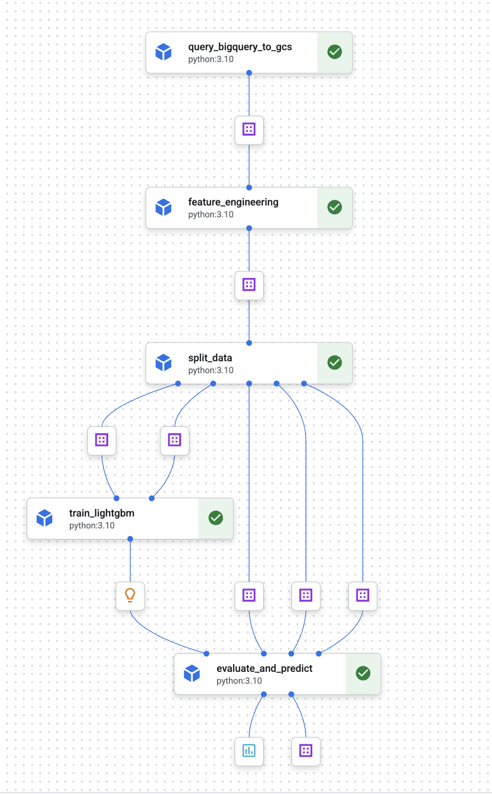

# Pipeline_Ph1

## 簡単な解説を書く

pipelineを実行すると以下のようにフローがコンソール上で確認できます。

## Pipeline詳細
| コンポーネント          | 内容                                                                                     |
| :---------------------- | :--------------------------------------------------------------------------------------- |
| `query_bigquery_to_gcs` | Bigquery を実行して、実行結果をGCSに保存する                                             |
| `feature_engineering`   | `query_bigquery_to_gcs`の結果を受取り、特徴量エンジニアリングを行う                      |
| `splid_data`            | `feature_engineering`の結果を受取り、学習用・検証用・推論用のデータを分割する            |
| `traing_lightgbm`       | 学習データを受取り、学習を実行する                                                       |
| `evaluate_and_predict`  | 学習済みのモデル、検証用・推論用データを受取り、モデル評価（RMSE）と推論結果の保存を行う |

※ pipeline簡略化のためtrain.csvデータセットから推論用データも分割している

## 簡単なコード解説を書く